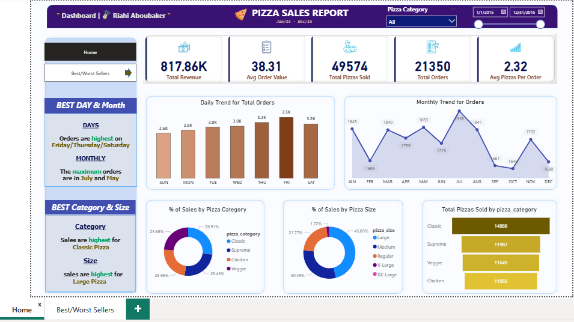
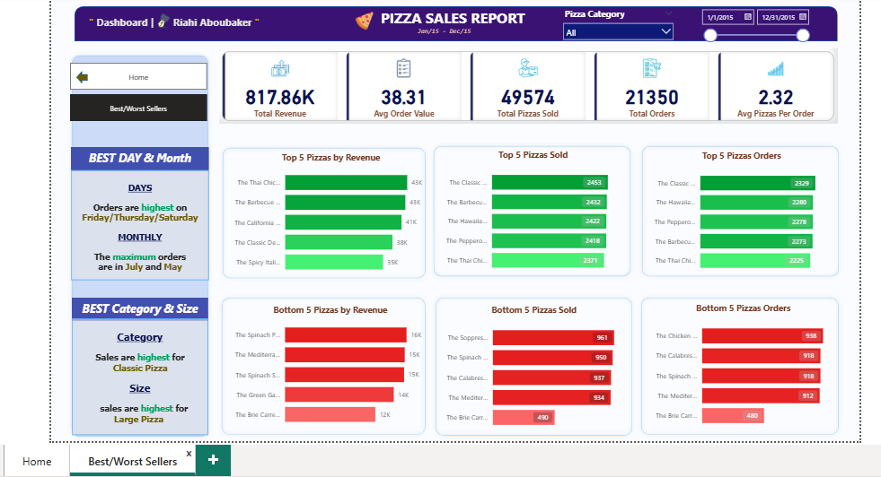

# 🍕 Pizza Sales Dashboard

## 📊 Project Overview
This project presents an **interactive Pizza Sales Dashboard** built with **Power BI**.  
It analyzes pizza sales performance across different categories, sizes, days, and months, highlighting **best and worst-selling pizzas**.

The goal is to transform raw sales data into clear and actionable insights for business decision-making.

---

## 🎥 Demo Video  
[Watch the Dashboard in Action](https://github.com/AboubakerRiahi/Pizza-Sales-Dashboard-Power-BI/blob/main/dashboard_demo.mp4))

"If the video doesn’t show, you can download it by clicking on 'View Raw'."

---

## 📸 Dashboard Screenshots
### Page 1 – Sales Overview

### Page 2 – Best & Worst Sellers

---

## 🚀 Features
- Key KPIs: **Total Revenue, Avg Order Value, Orders, and Pizzas Sold**
- Daily & Monthly Sales Trends
- Best/Worst Selling Pizzas by Revenue, Quantity, and Orders
- Sales Analysis by **Category & Size**
- Clean and interactive Power BI visuals

---

## 🛠 Tools Used
- **Power BI** – Dashboard creation & visualization
- **Excel/CSV Dataset** – Pizza sales data

---

